PM Assignment 1
================
Dani Diehl, Gihani Dissanayake, Chloe Kwon, Jess Chung
August 6, 2017

Probability Practice
--------------------

### Part A


As shown by the math above, the fraction of people who are truthful clickers and answered "Yes" is 5/7.

### Part B


As shown by the math above, the probability of having the disease after testing positive is 19.9%. This means the test is not a particularly good indicator of having the disease and that the test is giving a lot of False Positives. If a universal testing policy were implemented, additional screening and testing would need to be done on those who tested positive to further confirm whether or not they have the disease.

Exploratory Analysis: green buildings
-------------------------------------

``` r
gb<-read.csv("greenbuildings.csv")
gb[is.na(gb)] <- 0
```

Using exploratory analysis, we can see that the analysis performed by on-staff stats guru is flawed in the following ways: 1. Filtering out buildings with low occupancy rates effectively removed 214 non-green buildings and 1 green building from the dataset which potentially could result in biased results.

``` r
gb.scrubbed <- gb[gb$leasing_rate<10,]
cat("Number of buildings removed by analyst:",nrow(gb.scrubbed),"\n")
```

    ## Number of buildings removed by analyst: 215

``` r
cat("Number of non-green buildings removed by analyst:",nrow(gb.scrubbed[gb.scrubbed$green_rating==0,]))
```

    ## Number of non-green buildings removed by analyst: 214

The analyst's logic that buildings with less than 10% occupancy are "weird" and should be subject to removal is incomplete. Additional analysis needs to be performed to determine the cause behind these low occupancy rates before this data can be dismissed.

``` r
gb.mean = apply(gb, 2, mean)
gb.scrubbed.mean = apply(gb.scrubbed, 2, mean)
gb.scrubbed.mean - gb.mean
```

    ##     CS_PropertyID           cluster              size           empl_gr 
    ##      6.310258e+05     -5.244758e+01     -1.724286e+05      6.891545e-01 
    ##              Rent      leasing_rate           stories               age 
    ##     -5.974522e+00     -8.132660e+01     -8.765890e+00      7.174622e+00 
    ##         renovated           class_a           class_b              LEED 
    ##     -6.790085e-02     -2.975984e-01      2.890921e-02     -6.840638e-03 
    ##        Energystar      green_rating               net         amenities 
    ##     -7.616971e-02     -8.212360e-02     -3.005874e-02     -4.056723e-01 
    ##       cd_total_07        hd_total07       total_dd_07     Precipitation 
    ##      4.463621e+02     -2.912842e+02      1.550779e+02     -7.387077e-01 
    ##         Gas_Costs Electricity_Costs      cluster_rent 
    ##      2.432000e-04      1.524682e-04     -3.510820e+00

On average, we can see that the removed buildings have on average lower rent, a higher age and are less likely to be close to amenities or be in the nicest Class A of buildings. Higher age and lack of amenities may explain low occupancy rates. For the purposes of our analysis, we will include these low occupancy buildings.

2.Looking at green buildings and non-green buildings and their relationship with rent without accounting for other variables does show that the green rating variable is significant. Because the coefficient is positive, we might assume that green buildings have higher rents.

``` r
basic<-lm(gb$Rent~gb$green_rating)
summary(basic)
```

    ## 
    ## Call:
    ## lm(formula = gb$Rent ~ gb$green_rating)
    ## 
    ## Residuals:
    ##     Min      1Q  Median      3Q     Max 
    ## -25.287  -9.044  -3.267   5.733 221.733 
    ## 
    ## Coefficients:
    ##                 Estimate Std. Error t value Pr(>|t|)    
    ## (Intercept)      28.2668     0.1775 159.275   <2e-16 ***
    ## gb$green_rating   1.7493     0.6025   2.903   0.0037 ** 
    ## ---
    ## Signif. codes:  0 '***' 0.001 '**' 0.01 '*' 0.05 '.' 0.1 ' ' 1
    ## 
    ## Residual standard error: 15.07 on 7892 degrees of freedom
    ## Multiple R-squared:  0.001067,   Adjusted R-squared:  0.0009405 
    ## F-statistic:  8.43 on 1 and 7892 DF,  p-value: 0.003701

However, we must control for other variables that may be the true reason behind the underlying effect.

``` r
summary(lm(Rent~.,data=gb))
```

    ## 
    ## Call:
    ## lm(formula = Rent ~ ., data = gb)
    ## 
    ## Residuals:
    ##     Min      1Q  Median      3Q     Max 
    ## -53.547  -3.628  -0.528   2.485 174.162 
    ## 
    ## Coefficients: (1 not defined because of singularities)
    ##                     Estimate Std. Error t value Pr(>|t|)    
    ## (Intercept)       -7.746e+00  9.761e-01  -7.936 2.38e-15 ***
    ## CS_PropertyID      2.746e-07  1.566e-07   1.753 0.079619 .  
    ## cluster            7.929e-04  2.826e-04   2.806 0.005029 ** 
    ## size               6.751e-06  6.530e-07  10.339  < 2e-16 ***
    ## empl_gr            5.690e-02  1.671e-02   3.406 0.000663 ***
    ## leasing_rate       9.198e-03  5.300e-03   1.736 0.082684 .  
    ## stories           -3.200e-02  1.606e-02  -1.993 0.046333 *  
    ## age               -1.185e-02  4.659e-03  -2.542 0.011032 *  
    ## renovated         -1.414e-01  2.565e-01  -0.551 0.581643    
    ## class_a            2.863e+00  4.342e-01   6.593 4.60e-11 ***
    ## class_b            1.147e+00  3.408e-01   3.365 0.000769 ***
    ## LEED               1.873e+00  3.576e+00   0.524 0.600476    
    ## Energystar        -2.941e-01  3.811e+00  -0.077 0.938499    
    ## green_rating       7.647e-01  3.832e+00   0.200 0.841834    
    ## net               -2.512e+00  5.913e-01  -4.249 2.18e-05 ***
    ## amenities          6.320e-01  2.500e-01   2.528 0.011490 *  
    ## cd_total_07       -1.224e-04  1.461e-04  -0.838 0.402157    
    ## hd_total07         4.867e-04  8.672e-05   5.612 2.07e-08 ***
    ## total_dd_07               NA         NA      NA       NA    
    ## Precipitation      3.527e-02  1.531e-02   2.303 0.021299 *  
    ## Gas_Costs         -3.147e+02  7.679e+01  -4.098 4.21e-05 ***
    ## Electricity_Costs  1.652e+02  2.294e+01   7.205 6.35e-13 ***
    ## cluster_rent       1.017e+00  1.373e-02  74.043  < 2e-16 ***
    ## ---
    ## Signif. codes:  0 '***' 0.001 '**' 0.01 '*' 0.05 '.' 0.1 ' ' 1
    ## 
    ## Residual standard error: 9.397 on 7872 degrees of freedom
    ## Multiple R-squared:  0.6125, Adjusted R-squared:  0.6114 
    ## F-statistic: 592.4 on 21 and 7872 DF,  p-value: < 2.2e-16

When looking at the output of the regression of Rent on all of the variables in the dataset, green rating does not appear to be significant. This means that holding all other variables constant, green rating may not have an impact on the rent charged. From this output, other variables, including electricity and gas costs, the class of the building, the size, and the employment growth rate of the region, seem to be more important in predicting the rent.

``` r
boxplot(gb$Rent~gb$green_rating, pch=19, col='pink',xlab='Green Rating',ylab='Rent')
```

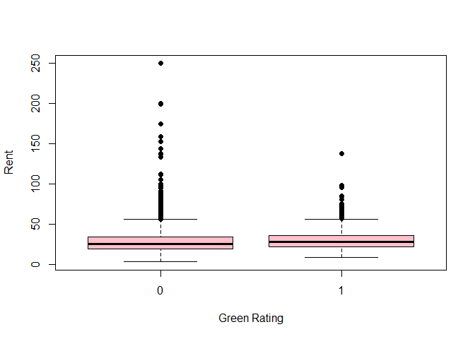

Green buildings have a slightly higher median rent than non-green buildings. However, the range of the rent of green buildings is much smaller than the range of rent of non-green buildings. Non-green buildings seem to have more outliers with very high rent. We must dig deeper into other factors that could be contributing to the difference in rent.

``` r
library(ggplot2)
```

    ## Warning: package 'ggplot2' was built under R version 3.4.1

``` r
t<-ggplot(gb,aes(x=cluster, y=Rent))
t+geom_point(aes(color=factor(green_rating)))
```

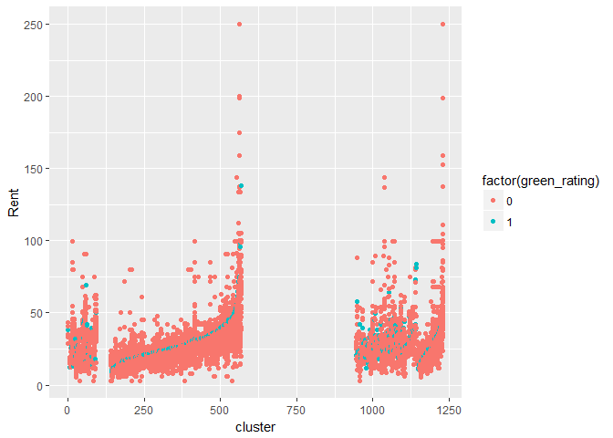

By graphing cluster on the x-axis and Rent on the y-axis, we attempt to control for other factors that may be influencing the rent. Clusters were made based on buildings located in the same geographical region. As you can see from the graph, the green buildings (shown in light blue) are not near the top of the rent for each cluster. Green buildings may have higher rent on average, but when limited to clusters, they do not appear to have the highest rent.

1.  Since whether or not a building is green is not a strong predictor of rent, the analyst's conclusion that the developer could receive an extra $650K a year is incorrect. Further more, the analyst's assertion that the developer could continue to earn an extra $650K for the lifetime of the building is incorrect. From the multiple regression above, we can see that an increase in age of the building results in a statistically significant decrease in rent values. Also for the purposes of the diagram below, we can see that simple regression also shows that an increase in age results in a decrease in rent.

``` r
library(ggplot2)
ggplot(gb,aes(x=age, y=Rent))+geom_point(aes(color=factor(green_rating)))+ geom_smooth(method = 'lm', formula=y~x)
```

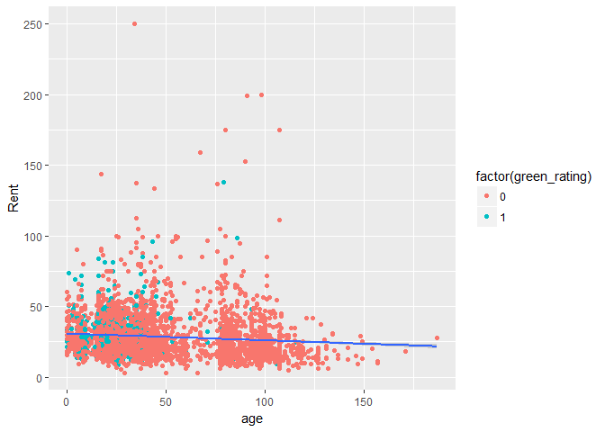

``` r
age.lm = lm(gb$Rent~gb$age)
summary(age.lm)
```

    ## 
    ## Call:
    ## lm(formula = gb$Rent ~ gb$age)
    ## 
    ## Residuals:
    ##     Min      1Q  Median      3Q     Max 
    ## -26.316  -9.158  -3.050   5.318 220.945 
    ## 
    ## Coefficients:
    ##              Estimate Std. Error t value Pr(>|t|)    
    ## (Intercept) 30.689767   0.299751 102.384   <2e-16 ***
    ## gb$age      -0.048074   0.005243  -9.169   <2e-16 ***
    ## ---
    ## Signif. codes:  0 '***' 0.001 '**' 0.01 '*' 0.05 '.' 0.1 ' ' 1
    ## 
    ## Residual standard error: 15 on 7892 degrees of freedom
    ## Multiple R-squared:  0.01054,    Adjusted R-squared:  0.01041 
    ## F-statistic: 84.07 on 1 and 7892 DF,  p-value: < 2.2e-16

``` r
coef(age.lm)
```

    ## (Intercept)      gb$age 
    ## 30.68976656 -0.04807381

1.  Lastly, the assumption that the building would be able to recoup the cost of green certification after 8 years assuming 90% occupancy is potentially faulty. While the general distribution of leasing rates for green and non-green buildings are similar, this still means that 38% of green buildings have lower than 90% occupancy. As we have explained above, this low occupancy could be explained by other factors such as amenities and employment growth rate. However, without further examination of these values for Austin, we cannot make assumptions of greater than 90% occupancy.

``` r
library(ggplot2)
ggplot(gb,aes(x=leasing_rate))+geom_histogram(breaks=seq(20, 100, by=5), aes(color=factor(green_rating)))+ facet_wrap(~green_rating)
```

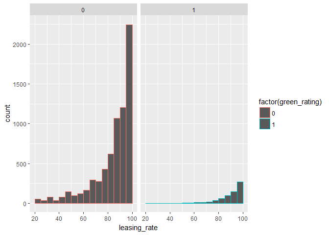

``` r
numgreen = sum(gb$green_rating==1)
cat("Number of green buildings:",numgreen,"\n")
```

    ## Number of green buildings: 685

``` r
numless90 = sum(gb$leasing_rate<90 & gb$green_rating==1)
cat("Number of green buildings with less than 90% occupancy:",numless90,"\n")
```

    ## Number of green buildings with less than 90% occupancy: 265

``` r
numgreenless90 = sum(gb$leasing_rate<90 & gb$green_rating==1)/sum(gb$green_rating==1)
cat("Percentage of green buildings with less than 90% occupancy:", numgreenless90)
```

    ## Percentage of green buildings with less than 90% occupancy: 0.3868613

In conclusion, there are several flaws in the analyst's report that primarily stem from an oversimplification of the problem at hand. With additional consideration to other variables such as age, growth in employment, neighborhood cluster etc, we observe that the green rating for a building is not a statistically significant predictor of rent/income to the developer.

Bootstrapping
-------------

1.  Characterize risk/return properties of US domestic equities (SPY: the S&P 500 stock index), US Treasury bonds (TLT), Investment-grade corporate bonds (LQD), Emerging-market equities (EEM), and Real estate (VNQ).

``` r
library(mosaic)
library(quantmod) #stock info mod
library(foreach)


mystocks = c("SPY", "TLT", "LQD","EEM","VNQ")
getSymbols(mystocks) #goes on yahoo finance, downloads data
```

    ## [1] "SPY" "TLT" "LQD" "EEM" "VNQ"

``` r
for(ticker in mystocks) {
  expr = paste0(ticker, "a = adjustOHLC(", ticker, ")")
  eval(parse(text=expr))
}

SPYa_returns = as.matrix(na.omit(ClCl(SPYa)))
SPYReturnAvg=mean(SPYa_returns)
SPYReturnSD=sd(SPYa_returns)
spy=c(SPYReturnAvg,SPYReturnSD)

TLTa_returns = as.matrix(na.omit(ClCl(TLTa)))
TLTReturnAvg=mean(TLTa_returns)
TLTReturnSD=sd(TLTa_returns)
tlt=c(TLTReturnAvg,TLTReturnSD)

LQDa_returns = as.matrix(na.omit(ClCl(LQDa)))
LQDReturnAvg=mean(LQDa_returns)
LQDReturnSD=sd(LQDa_returns)
lqd=c(LQDReturnAvg,LQDReturnSD)

EEMa_returns = as.matrix(na.omit(ClCl(EEMa)))
EEMReturnAvg=mean(EEMa_returns)
EEMReturnSD=sd(EEMa_returns)
eem=c(EEMReturnAvg,EEMReturnSD)

VNQa_returns = as.matrix(na.omit(ClCl(VNQa)))
VNQReturnAvg=mean(VNQa_returns)
VNQReturnSD=sd(VNQa_returns)
vnq=c(VNQReturnAvg,VNQReturnSD)

df<-data.frame(spy,tlt,lqd,eem,vnq)
rownames(df)<-c('Avg Return', 'SD Return')
df
```

    ##                    spy          tlt          lqd         eem          vnq
    ## Avg Return 0.000372642 0.0003051795 0.0002289702 0.001075159 0.0004418946
    ## SD Return  0.012792061 0.0094018798 0.0054066055 0.041961575 0.0219915376

As you can see from the above dataframe, the Emerging-market equities has the highest expected return, but also the highest standard deviation. Therefore, EEM is the riskiest of the above ETFs. The Investment-grade corporate bonds have the lowest average return and also the lowest standard deviation. These facts make LQD the safest choice as an investment, but you have a smaller chance of making a larger return. US domestic equities and US Treasury bonds (SPY and TLT) are also relatively safe investments, with low risk but relatively low returns. Real estate (VNQ) has the second highest average return and the second highest standard deviation as well, making it safer than EEM but riskier than the rest.

1.  Outline our choice of safe and aggressive portfolios.

For our safe portfolio, we decided to only invest in Investment-grade corporate bonds (LQD), US treasury bonds (TLT), and US domestic equities (SPY). These were the three safest investment choices due to their low standard deviation and risk. The expected returns are not as high as the other ETF's, but in the safe portfolio, we minimize the risk in the risk-reward tradeoff. We invested 60% in LQD (lowest risk), 30% in TLT, and 10% in SPY. For our aggressive portfolio, we decided to only invest in the Emerging-market equities (EEM) and Real estate (VNQ). These have the highest expected return and the highest standard deviation/risk. In this portfolio, we are increases the risk to hopefully increase the reward. We invested 80% in EEM (the riskiest) and 20% in VNQ.

1.  Use bootstrap resampling to estimate the 4-week (20 trading day) value at risk of each of your three portfolios at the 5% level.

``` r
#####################################################
#equal split
#####################################################
all_returns1 = cbind(   ClCl(SPYa),
                     ClCl(TLTa),
                     ClCl(LQDa),
                     ClCl(EEMa),
                     ClCl(VNQa))
all_returns1 = as.matrix(na.omit(all_returns1))

# Now simulate many different possible scenarios  
initial_wealth = 100000
sim1 = foreach(i=1:5000, .combine='rbind') %do% {
  total_wealth = initial_wealth
  weights = c(0.2, 0.2, 0.2, 0.2, 0.2)
  holdings = weights * total_wealth
  n_days = 20
  wealthtracker = rep(0, n_days)
  for(today in 1:n_days) {
    return.today = resample(all_returns1, 1, orig.ids=FALSE)
    holdings = holdings + holdings*return.today 
    total_wealth = sum(holdings)
    wealthtracker[today] = total_wealth
    holdings = weights * total_wealth 
  }
  wealthtracker
}
# Calculate 5% value at risk
equalVAR=quantile(sim1[,n_days], 0.05) - initial_wealth

################################################################
#something safer
################################################################

all_returns2 = cbind(   ClCl(SPYa),
                      ClCl(TLTa),
                      ClCl(LQDa))
all_returns2 = as.matrix(na.omit(all_returns2))

# Now simulate many different possible scenarios  
initial_wealth = 100000
sim2 = foreach(i=1:5000, .combine='rbind') %do% {
  total_wealth = initial_wealth
  weights = c(0.1, 0.3, 0.6)
  holdings = weights * total_wealth
  n_days = 20
  wealthtracker = rep(0, n_days)
  for(today in 1:n_days) {
    return.today = resample(all_returns2, 1, orig.ids=FALSE)
    holdings = holdings + holdings*return.today
    total_wealth = sum(holdings)
    wealthtracker[today] = total_wealth
    holdings = weights * total_wealth 
  }
  wealthtracker
}
# Calculate 5% value at risk
safeVAR=quantile(sim2[,n_days], 0.05) - initial_wealth

################################################################
#something more aggressive
################################################################

all_returns3 = cbind(ClCl(EEMa),
                      ClCl(VNQa))
all_returns3 = as.matrix(na.omit(all_returns3))

# Now simulate many different possible scenarios  
initial_wealth = 100000
sim3 = foreach(i=1:5000, .combine='rbind') %do% {
  total_wealth = initial_wealth
  weights = c(0.8,0.2)
  holdings = weights * total_wealth
  n_days = 20
  wealthtracker = rep(0, n_days)
  for(today in 1:n_days) {
    return.today = resample(all_returns3, 1, orig.ids=FALSE)
    holdings = holdings + holdings*return.today
    total_wealth = sum(holdings)
    wealthtracker[today] = total_wealth
    holdings = weights * total_wealth 
  }
  wealthtracker
}
# Calculate 5% value at risk
aggressiveVAR=quantile(sim3[,n_days], 0.05) - initial_wealth
df2=rbind(equalVAR, safeVAR, aggressiveVAR)
df2
```

    ##                       5%
    ## equalVAR       -6519.086
    ## safeVAR        -3181.815
    ## aggressiveVAR -13146.136

In the dataframe labeled df2, you can see the value at risk at the 5% level for the Equal portfolio, Safe portfolio, and Aggressive portfolio, respectively. As you would expect, the value at risk for the safest portfolio is the smallest, and the value at risk for the aggressive portfolio is the largest.

1.  Compare the results for each portfolio in a way that would allow the reader to make an intelligent decision among the three options.

``` r
sd1=sd(sim1[,n_days]) #5655.20
mean1=mean(sim1[,n_days]) #100907.62

equal_confint= range(mean1-2*sd1, mean1+2*sd1)

sd2=sd(sim2[,n_days]) #2277.48 (smaller than sd1--less range) 
mean2=mean(sim2[,n_days]) #100522 (less than mean1)
safe_confint= range(mean2-2*sd2,mean2+2*sd2)


sd3=sd(sim3[,n_days]) #14884 (much bigger variation) 
mean3=mean(sim3[,n_days]) #101533 (much more than others)
agg_confint=range(mean3-2*sd3, mean3+2*sd3)

df3<-rbind(equal_confint,safe_confint,agg_confint)
df3
```

    ##                   [,1]     [,2]
    ## equal_confint 90393.98 111376.4
    ## safe_confint  95954.40 104995.4
    ## agg_confint   67349.79 136465.1

In the dataframe above, you can see the 95% confidence intervals for the total wealth one is expected to have after investing $100,000 into the equal, safe, and aggressive portfolios for 20 trading days. The 95% confidence interval for the equal split porfolio is \[89597, 112218\]. The 95% confidence interval for the safe portfolio is \[95967, 105077\]. The 95% confidence interval for the aggressive portfolio is \[71764,131301\]. Readers will be able to look at this information, see the potential for both loss and gain in each portfolio, and make a decision based on these facts. By computing the expected gain, expected standard deviation, and 95% confidence interval, readers will have a good idea about the risk-reward tradeoff for each portfolio.

Market Segmentation
-------------------

We grouped the types of tweets into ten clusters, which we found to be the optimal representation of all the different categories of tweets that are worth considering. We evaluated all users equally, because we didn't want the effect of everyday tweeters to outweigh the users who tweet more infrequently. This also makes targeting users more accurate in the future. However, not all clusters are created equally. By observing correlations between all the variables as well as running cluster analysis using kmeans with k=10, we identified ten clusters that represented similar interests within user groups. Amongst the ten aforementioned clusters, we found the following three to be the most strongly correlated and therefore are our top recommendations for applying market segmentation and targeted messaging.

1.  personal_fitness, health_nutrition, and outdoors
2.  college_uni, online_gaming, and sports_playing
3.  fashion, cooking, beauty, and pictures

These three groups are are our top recommendations for applying market segmentation. In an ideal world, targeted messaging should be applied to all ten groups for a maximum effect, but given resource constrains, narrowing the scope to a few groups might be preferred.

Given a user whose tweets typically fall into one of these clusters, we think they would best respond to messaging that is also related to topics in that cluster. For example, if there is a twitter user who often tweets about the outdoors and healthy living, we expect them to respond positively to messaging about personal fitness, health, or the outdoors.

If you would like to see a more detailed representation of these conclusions, please reference the code and outputs themselves.

``` r
library(ggplot2)
library(LICORS)  # for kmeans++
library(foreach)
library(mosaic)
library(tidyr)
library(cluster)

ms<-read.csv("social_marketing.csv", header=TRUE)
ms$X <- NULL
ms$spam <- NULL
ms$adult <- NULL
ms = ms/rowSums(ms)
X = scale(ms, center=TRUE, scale=TRUE)

#Observe correlations to determine intuitive pairs of categories to find segments of population
x = cor(ms)
#fix(x)
x[x == 1] = 0
#to get rid of cookingvscooking correlations
xdf = as.data.frame(as.table(x))
highcor = subset(xdf, Freq > 0.5)
head(highcor)
```

    ##                  Var1             Var2      Freq
    ## 459       college_uni    online_gaming 0.6361316
    ## 542  personal_fitness health_nutrition 0.6855875
    ## 558     online_gaming      college_uni 0.6361316
    ## 645           fashion          cooking 0.5497405
    ## 1070 health_nutrition personal_fitness 0.6855875
    ## 1107          cooking          fashion 0.5497405

``` r
#can change to .5 to narrow to top 3 pairs
#None have a strong neg correlation but I did consider it

#Find the ideal number of clusters
k.max = 25
data <- X
sil <- rep(0, k.max)
# Compute the average silhouette width for k = 2 to k = 25
set.seed(1)

for(i in 2:k.max) {
  km.res <- kmeanspp(data, k = i, nstart = 20)
  ss <- silhouette(km.res$cluster, dist(data))
  sil[i] <- mean(ss[, 3])
}
# Plot the  average silhouette width
plot(1:k.max, sil, type = "b", pch = 19, 
     frame = FALSE, xlab = "Number of clusters k")
abline(v = which.max(sil), lty = 2)
```

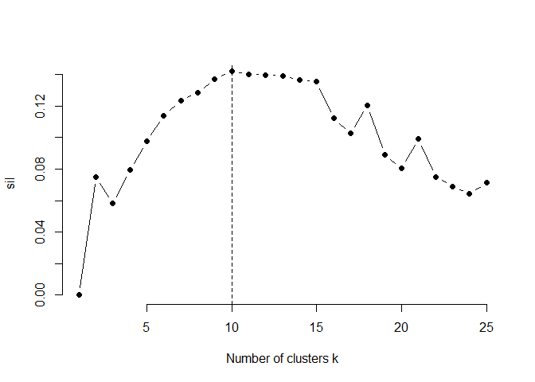

``` r
which.max(sil) #Max is 10
```

    ## [1] 10

``` r
#Cluster data with 10 clusters
set.seed(1)
ms$cluster <- kmeanspp(X, k=10, nstart=20)$cluster #using max of 10

#Cluster 1 is Outdoors, Personal Fitness, Health
health <- gather(data = ms, -health_nutrition,  -uncategorized, -cluster, key = "var", value = "value")
ggplot(data = health, aes(x = value, y = health_nutrition, color = factor(cluster))) + geom_point() + facet_wrap(~ var, scales = "free")
```

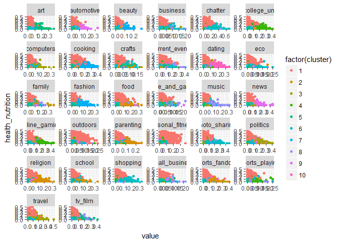

``` r
#cluster 2, high family, parenting, food, religion, school, sports fandom
parenting <- gather(data = ms, -parenting,  -uncategorized, -cluster, key = "var", value = "value")
ggplot(data = parenting, aes(x = value, y = parenting, color = factor(cluster))) + geom_point() + facet_wrap(~ var, scales = "free")
```

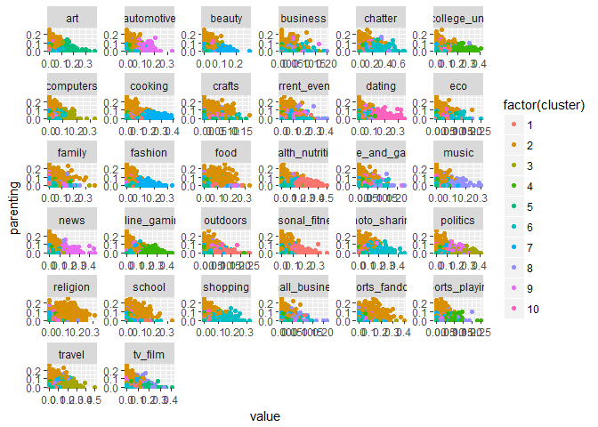

``` r
#cluster 3, politics, computer, travel, business
politics <- gather(data = ms, -politics, -uncategorized, -cluster, key = "var", value = "value")
ggplot(data = politics, aes(x = value, y = politics, color = factor(cluster))) + geom_point() + facet_wrap(~ var, scales = "free")
```

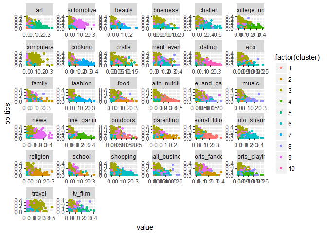

``` r
#cluster 4, high online gaming, sports playing, college
college <- gather(data = ms, -college_uni,  -uncategorized, -cluster, key = "var", value = "value")
ggplot(data = college, aes(x = value, y = college_uni, color = factor(cluster))) + geom_point() + facet_wrap(~ var, scales = "free")
```

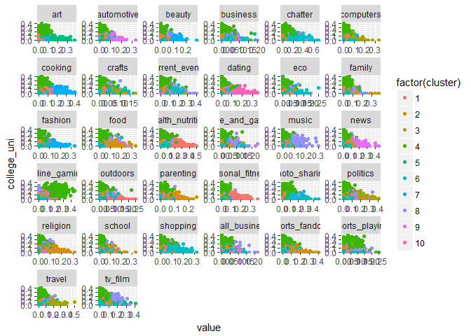

``` r
#cluster 5, art and tv/film, current events, crafts
art<- gather(data = ms, -art,  -uncategorized, -cluster, key = "var", value = "value")
ggplot(data = art, aes(x = value, y = art, color = factor(cluster))) + geom_point() + facet_wrap(~ var, scales = "free")
```

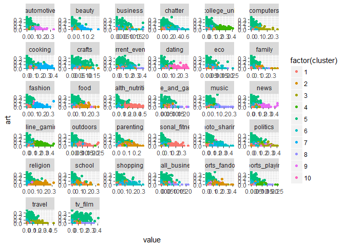

``` r
#cluster 6, high chatter, shopping, photo sharing
shopping<- gather(data = ms, -shopping,  -uncategorized, -cluster, key = "var", value = "value")
ggplot(data = shopping, aes(x = value, y = shopping, color = factor(cluster))) + geom_point() + facet_wrap(~ var, scales = "free")
```

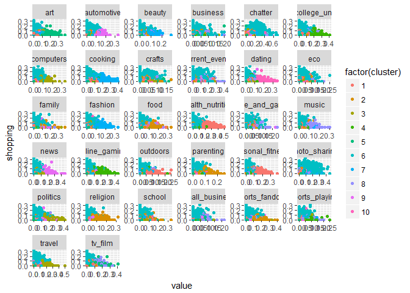

``` r
#Cluster 7, cooking, beauty, fashion, photo sharing
cooking <- gather(data = ms, -cooking,  -uncategorized, -cluster, key = "var", value = "value")
ggplot(data = cooking, aes(x = value, y = cooking, color = factor(cluster))) + geom_point() + facet_wrap(~ var, scales = "free")
```

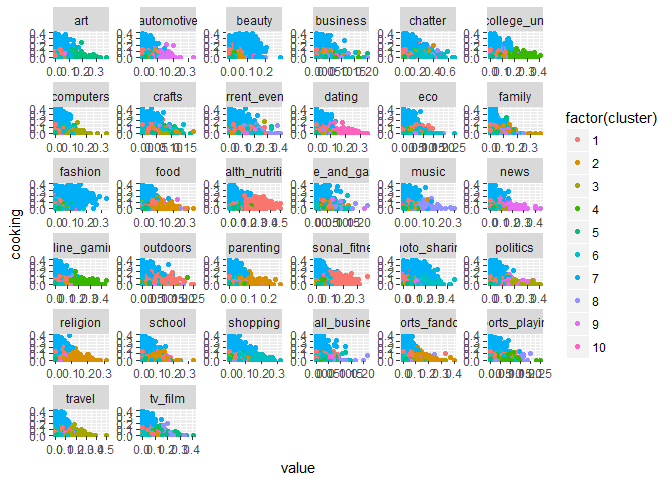

``` r
#cluster 8 hard to parse out

#cluster 9 is high auto, high news, 
automotive<- gather(data = ms, -automotive,  -uncategorized, -cluster, key = "var", value = "value")
ggplot(data = automotive, aes(x = value, y = automotive, color = factor(cluster))) + geom_point() + facet_wrap(~ var, scales = "free")
```

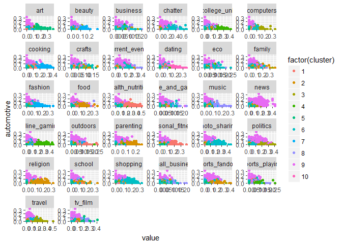

``` r
#cluster 10, high dating, low everything else
date<- gather(data = ms, -dating,  -uncategorized, -cluster, key = "var", value = "value")
ggplot(data = date, aes(x = value, y = dating, color = factor(cluster))) + geom_point() + facet_wrap(~ var, scales = "free")
```

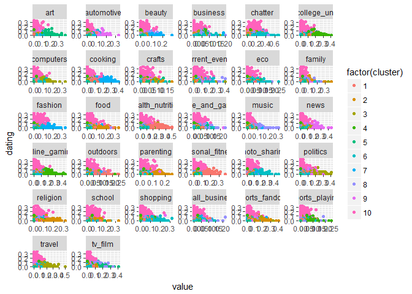
